# jms

### jdk jms

jdk jms 的用法如下所示：

* 发送端

```groovy
import org.apache.activemq.ActiveMQConnectionFactory

import javax.jms.Session
/**
*   发送方
*
* @author fade
* @date 2022 /08/14
*/
class Sender {

	static void main(String[] args) {
		def connectionFactory = new ActiveMQConnectionFactory()
		def connection = connectionFactory.createConnection()
		def session = connection.createSession(true, Session.AUTO_ACKNOWLEDGE)
		def queue = session.createQueue("test")
		def producer = session.createProducer(queue)
		def message = session.createTextMessage("test info")
		producer.send(message)
		session.commit()
		session.close()
		connection.close()
	}

}
```

* 接受端

```groovy
import org.apache.activemq.ActiveMQConnectionFactory

import javax.jms.Session
/**
*   接收者
*
* @author fade
* @date 2022 /08/14
*/
class Receiver {

	static void main(String[] args) {
		def connectionFactory = new ActiveMQConnectionFactory()
		def connection = connectionFactory.createConnection()
		connection.start()
		def session = connection.createSession(true, Session.AUTO_ACKNOWLEDGE)
		def queue = session.createQueue("test")
		def consumer = session.createConsumer(queue)
		def receive = consumer.receive()
		println receive.getText()
		session.commit()
		session.close()
		connection.close()
	}

}
```

可以总结为：

1. 创建连接工厂
2. 获取连接
3. 创建会话
4. 创建队列
5. 利用会话创建生产者/消费者
6. 如果是生产者，利用会话创建消息
7. 发送消息/接受消息
8. 提交会话
9. 关闭会话
10. 关闭连接

### spring jms

**spring jms 只不过是对jdk jms的操作进行了spring式的封装，比如对象的创建纳入spring容器及操作模板化**

spring jms操作的模板是 `JmsTemplate` ，它与 `JdbcTemplate` 的逻辑类似。

首先我们来看发送端：

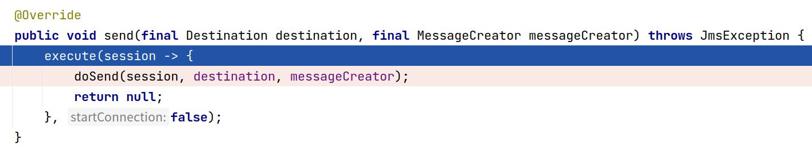

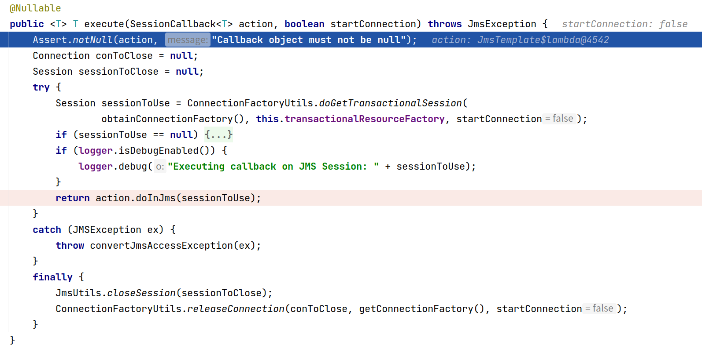

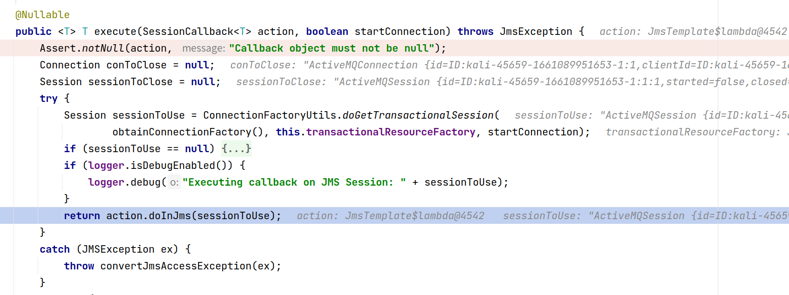

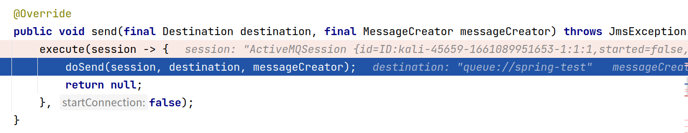

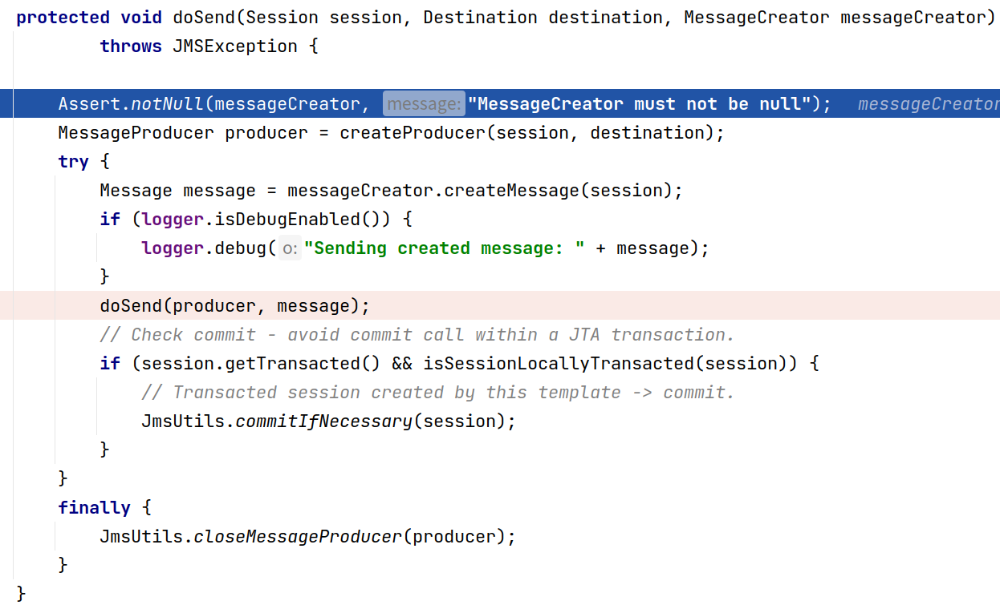

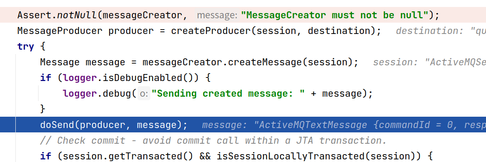

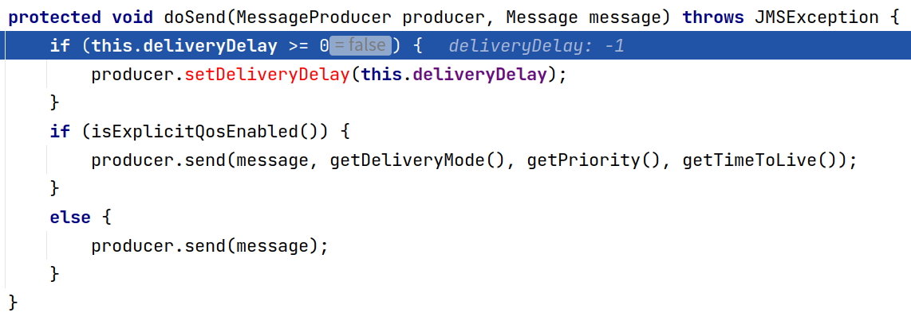

如果配置了监听器相关的bean，比如 `org.springframework.jms.listener.DefaultMessageListenerContainer` ，则发送端还会多一段这个流程：

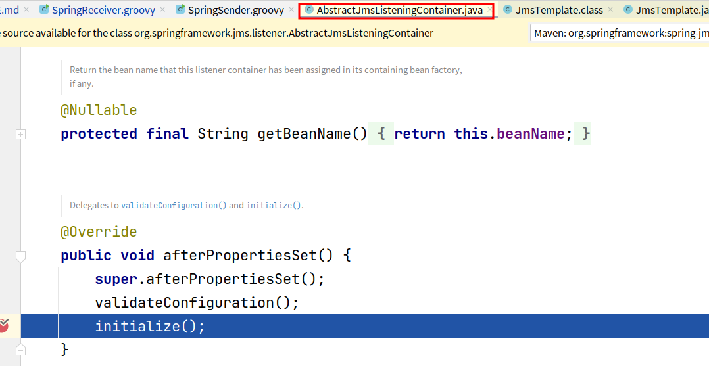

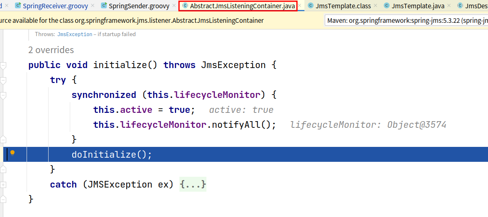

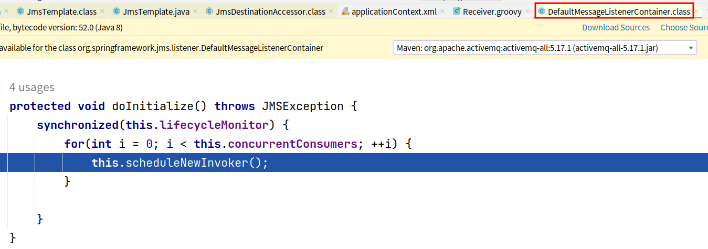

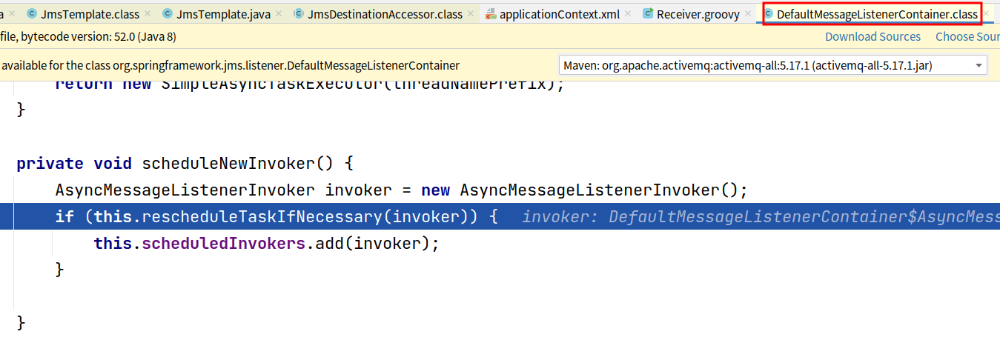

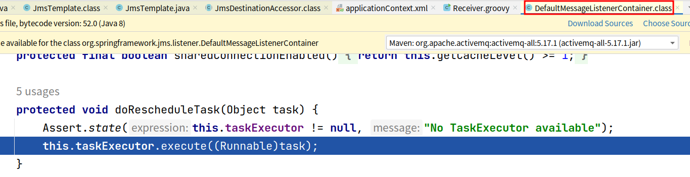

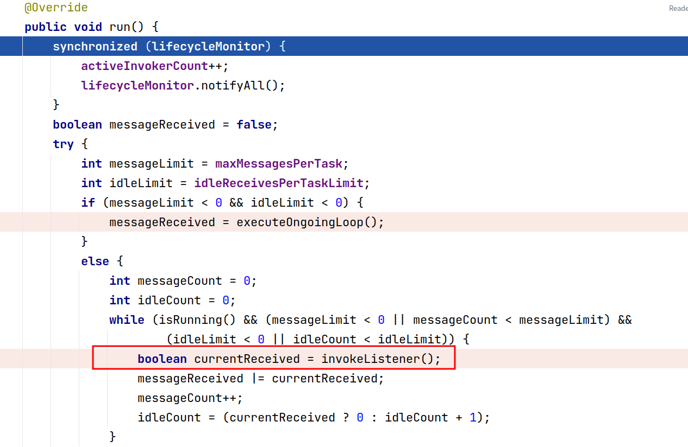

在上图可以看到这里有有关于调用监听器的逻辑

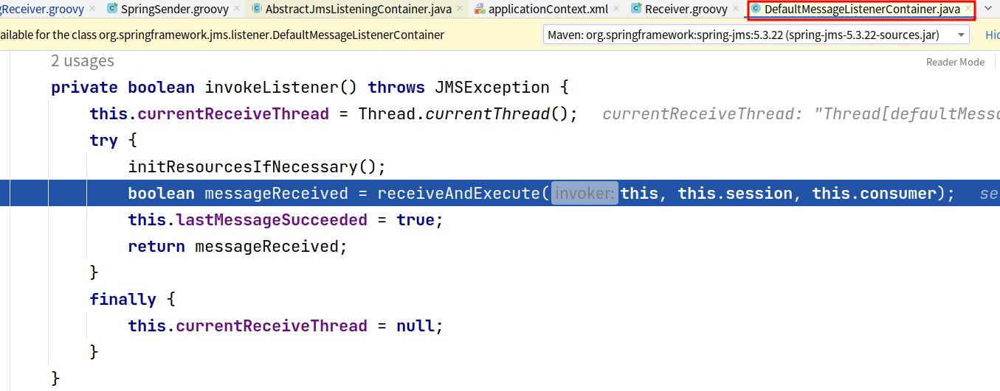

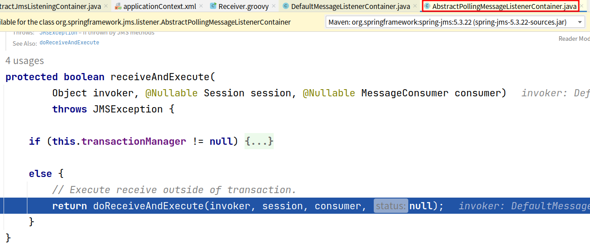

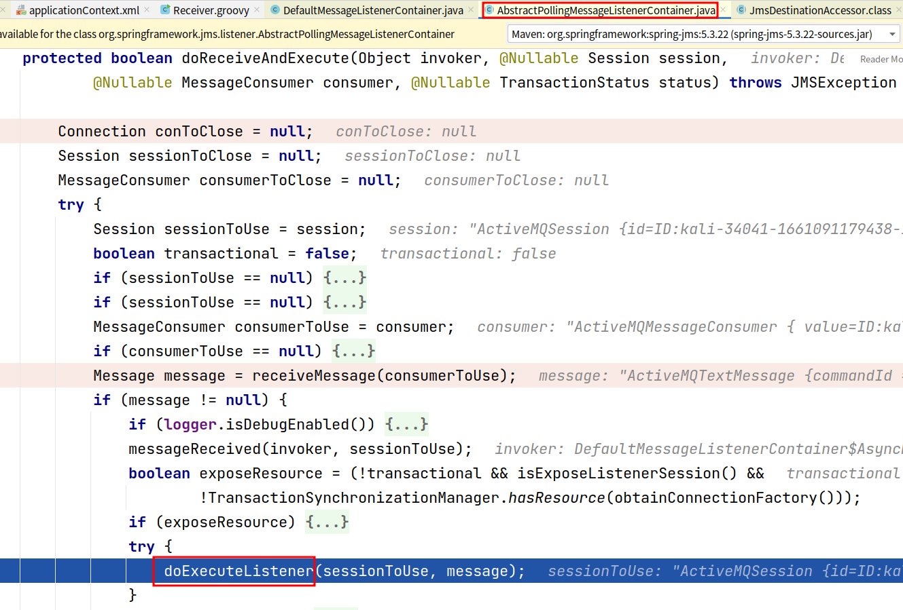

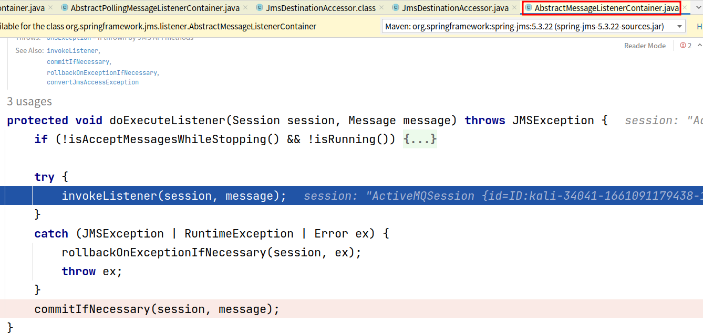


再来看看接受端：

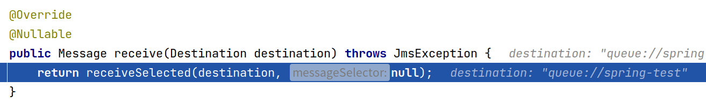

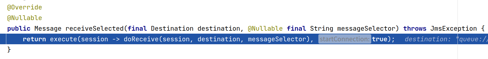

看到这里是不是很熟悉，也是调用了 `execute` 方法，联想到 `JdbcTemplate` ，这里也应该是通过传递不同的回调用于区分不同的操作


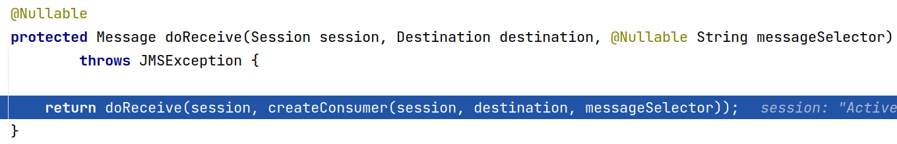

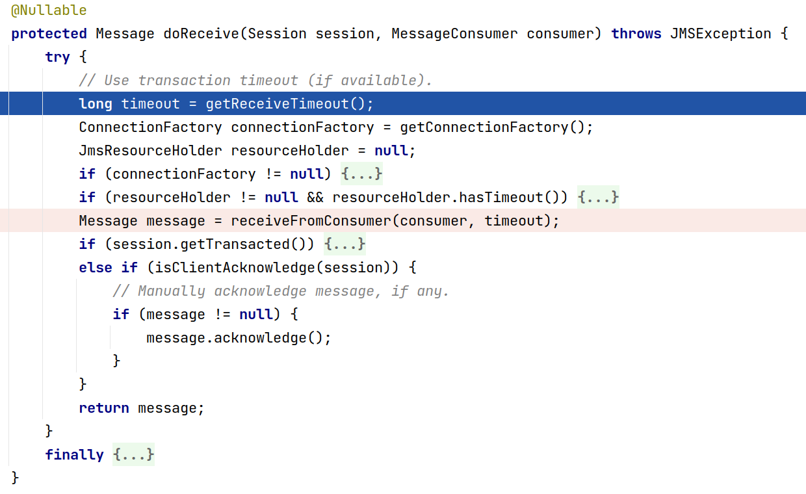

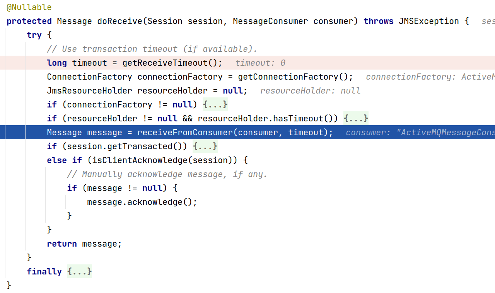

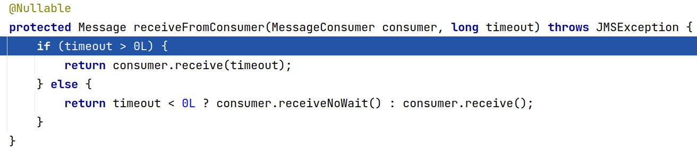
