# http invoker

### 为什么出现http invoker

rmi使用java标准的对象序列化，但是很难穿透防火墙；hessian能很好的穿透防火墙进行工作，但是它私有的序列化协议

### 与rest有什么区别

[rest是文本序列化，http invoker是二进制序列化](https://dubbo.apache.org/zh/docs/v2.7/user/rest/#%E6%A6%82%E8%BF%B0)

至于http invoker会传输对象，这个本人感觉并不是它与rest的区别，因为http invoker只是把调用的参数和调用结果都封装了一下，比如调用结果封装成 `RemoteInvocationResult` ，感觉本质上和rest没什么区别

### 源码分析

###### 服务端创建

我们先看一下 `HttpInvokerServiceExporter` 的层次结构：

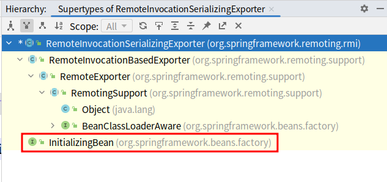

分析过几个spring提供的rpc集成方案的朋友应该不陌生了，就像其它方案一样， `HttpInvokerServiceExporter` 实现了 `InitializingBean` ，所以我们来看下它的 `afterPropertiesSet` 方法：

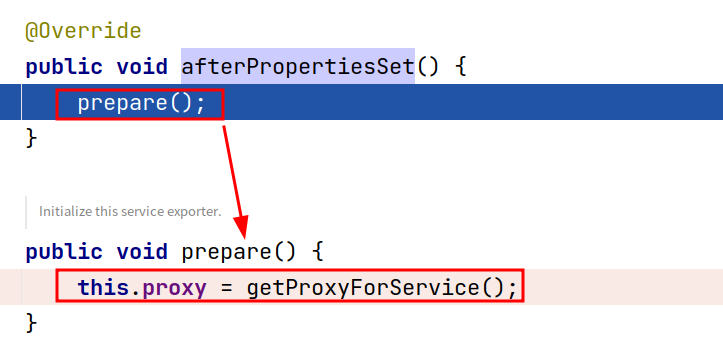

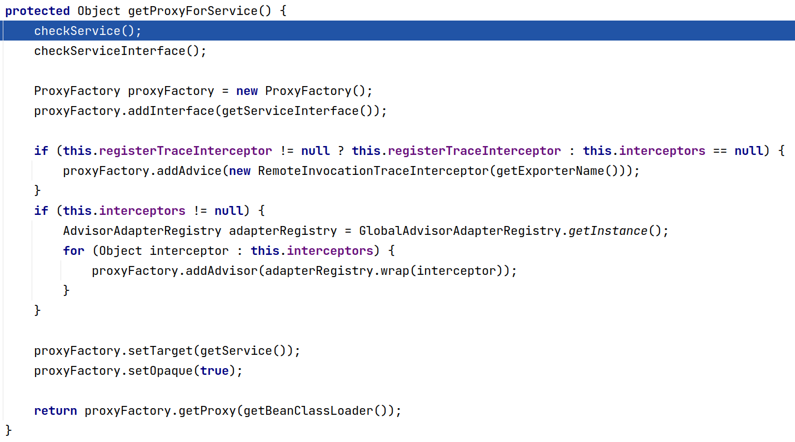

上面最后一张图蛮简单的，创建一个jdk aop代理

###### 客户端创建

`HttpInvokerProxyFactoryBean` 的层次结构为：

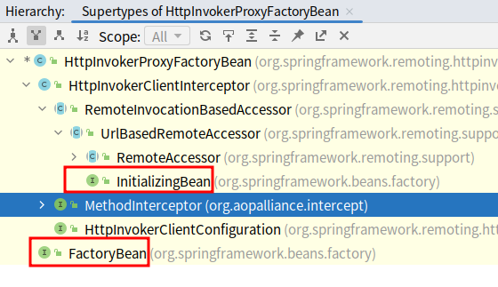

它实现了 `InitializingBean` 和 `FactoryBean` 接口

实现 `FactoryBean` 接口没什么特别的地方，就是返回一个代理对象：

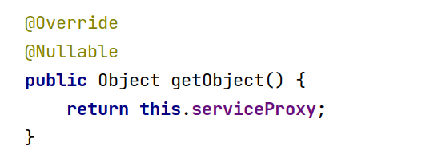

那就还是来看它实现 `InitializingBean` 得来的 `afterPropertiesSet` 方法：

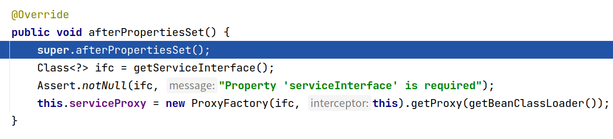

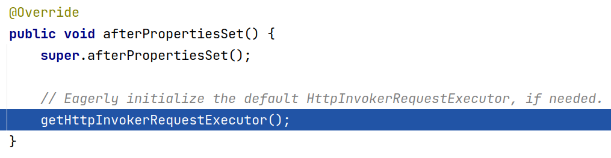

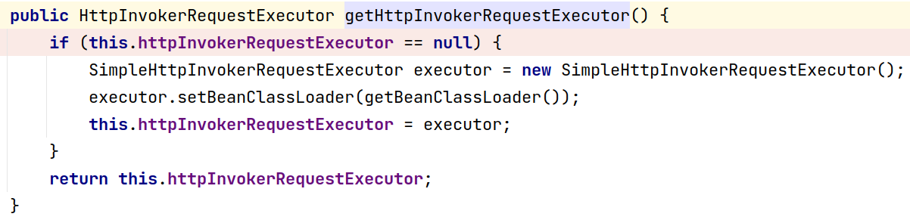

上面的方法执行途径主要创建了一个 `SimpleHttpInvokerRequestExecutor` 

回到前面：

剩下的代码就是把自身作为aop拦截器创建一个代理：

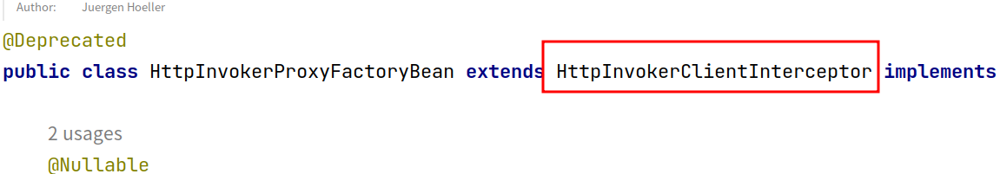

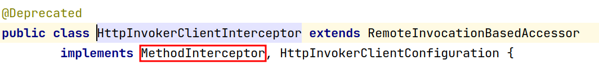

### 客户端调用远程对象方法

因为此时的远程对象是一个动态代理对象，所以它会执行到 `org.springframework.remoting.httpinvoker.HttpInvokerClientInterceptor.invoke` ：

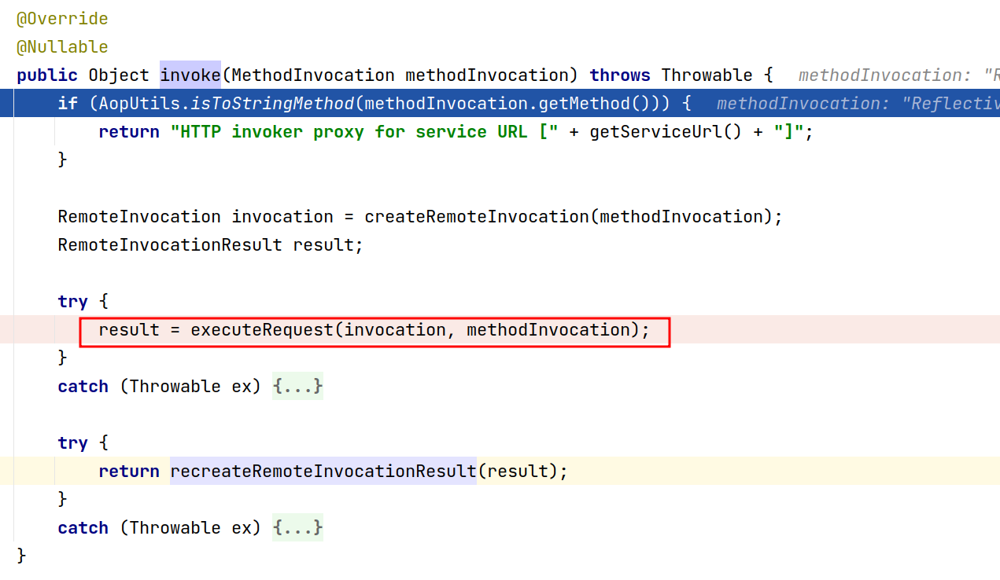

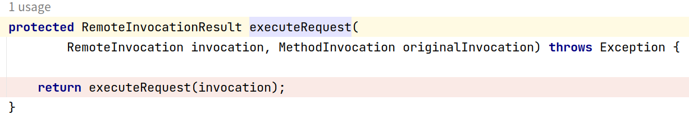

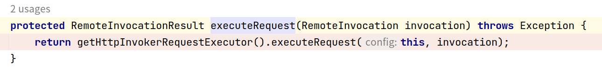

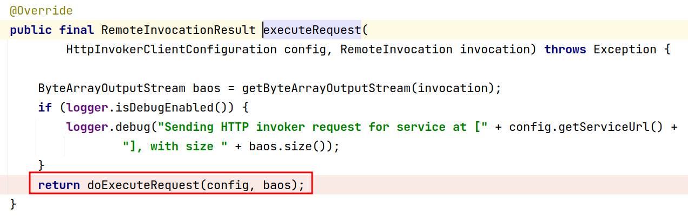

因为前面我们创建的 `HttpInvokerRequestExecutor` 是 `SimpleHttpInvokerRequestExecutor` 类型的，所以方法执行到了这：

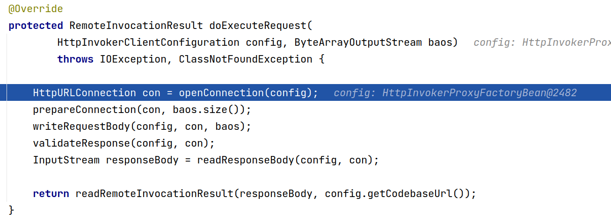

上图很明显先打开了一个连接，然后设置了一些连接的参数，把要调用的方法信息写到了连接中

### 服务端处理客户端请求

服务端会进入到 `DispatcherServlet` ，首先获取handler：

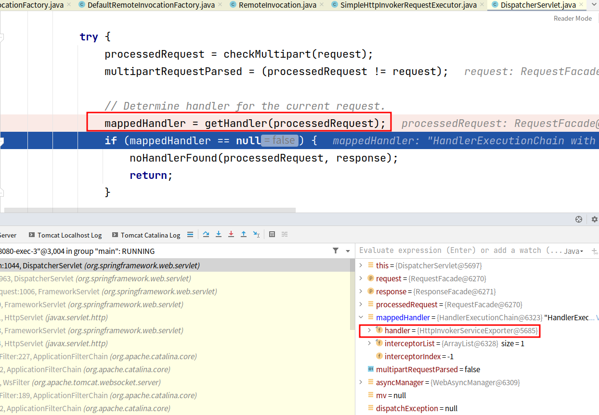

然后就如同正常处理controller方法一样，获取适配器，调用handler：

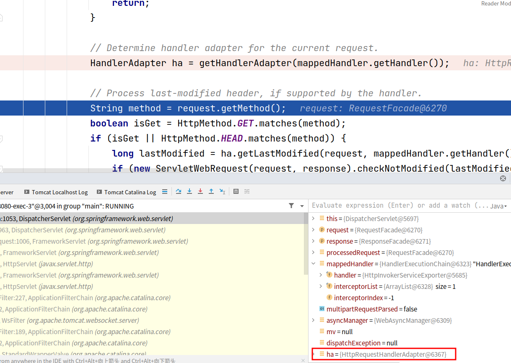

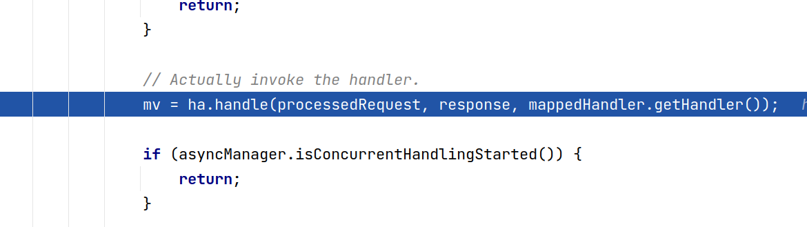

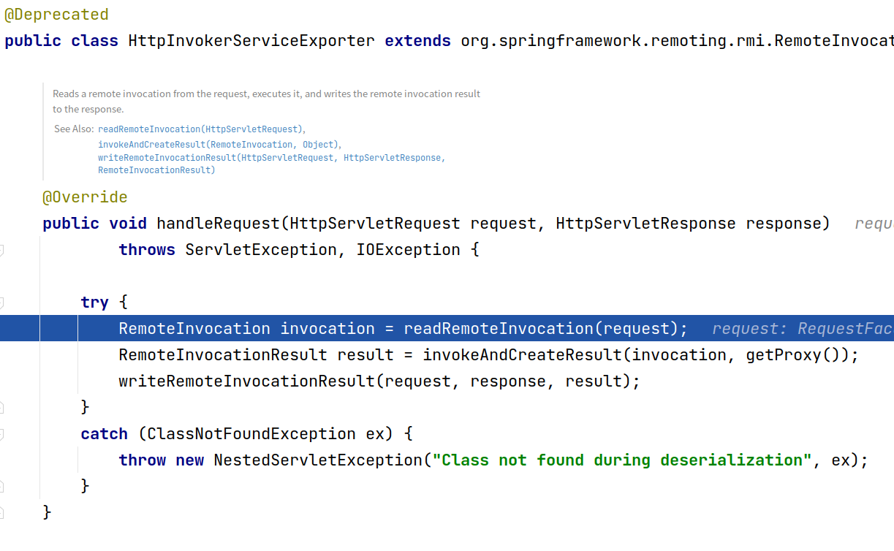

上图第一行首先把客户端的调用信息从连接中读取出来：

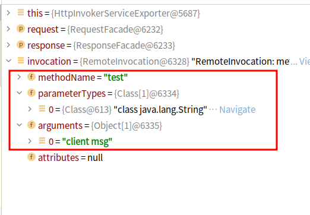

接着第二行是反射调用方法并封装成一个 `RemoteInvocationResult` ：

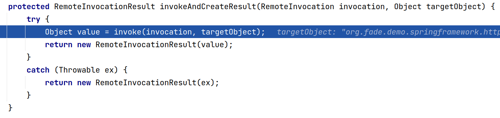

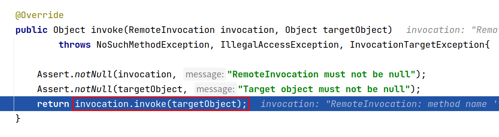

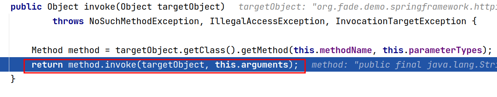

第三行是把前面生成的 `RemoteInvocationResult` 写入响应中

### 客户端处理服务端响应

客户端拿到 `RemoteInvocationResult` 后取出调用结果：

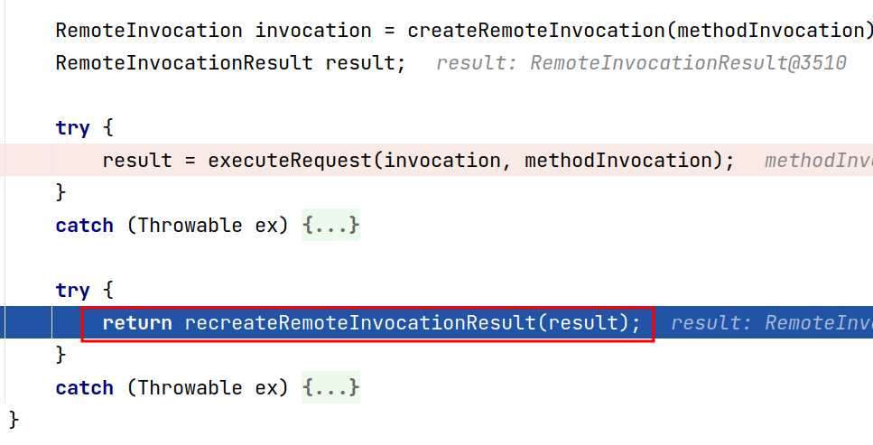

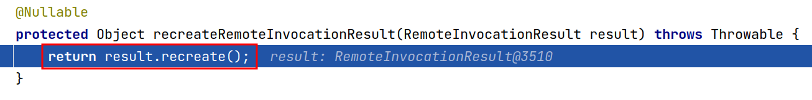

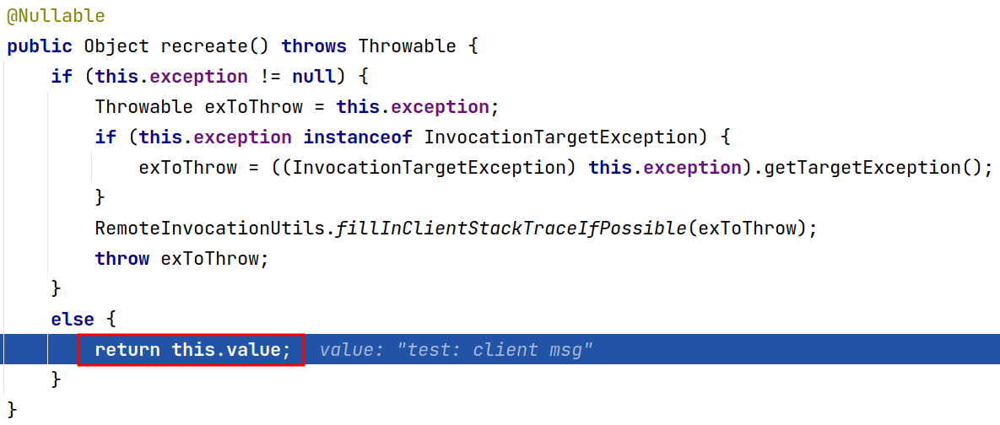