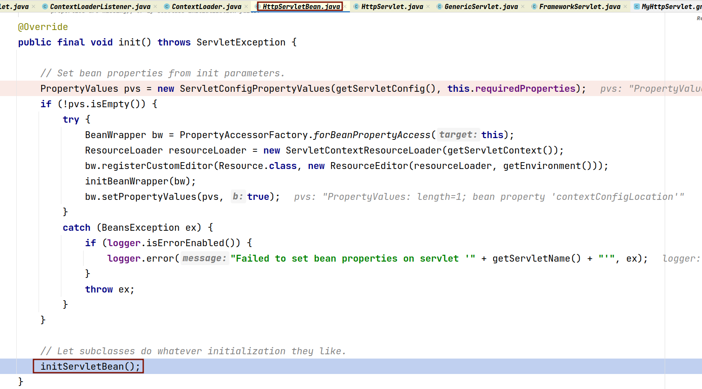
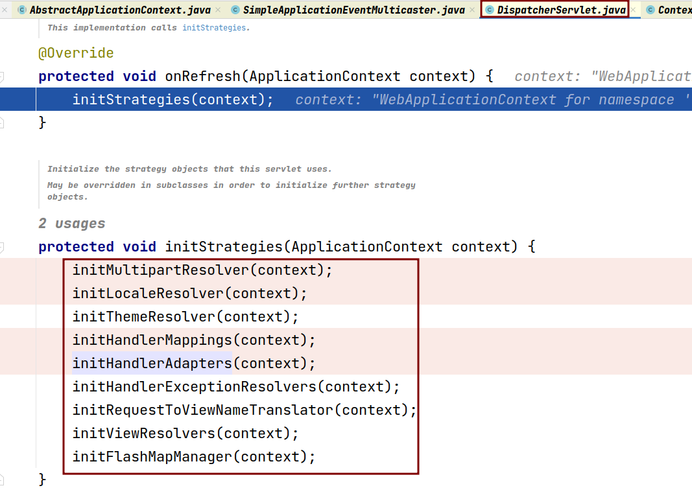
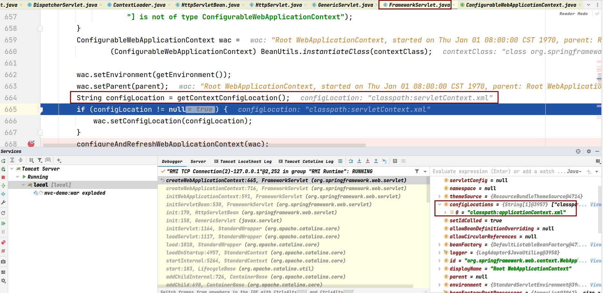
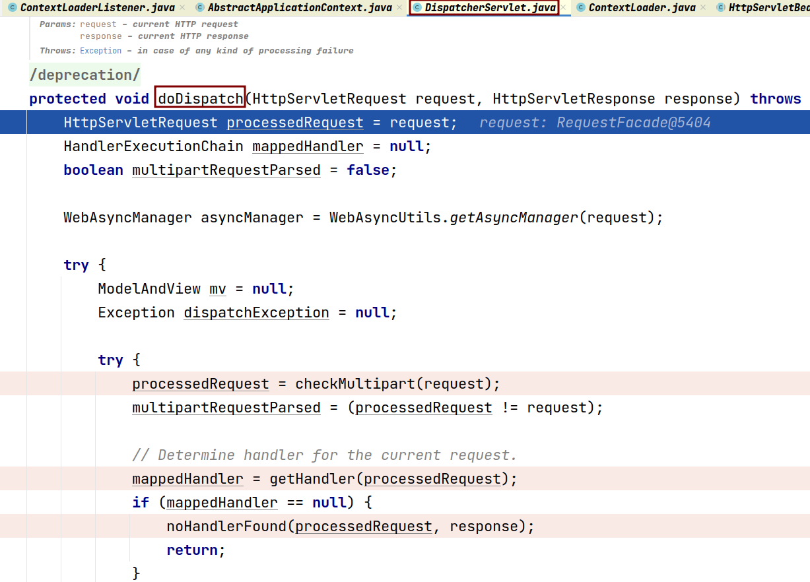
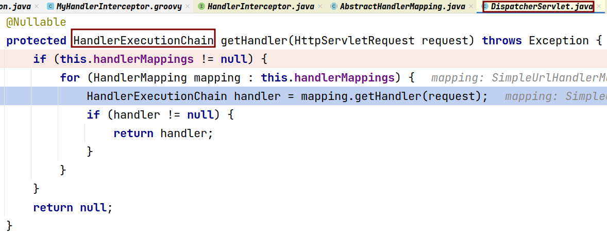
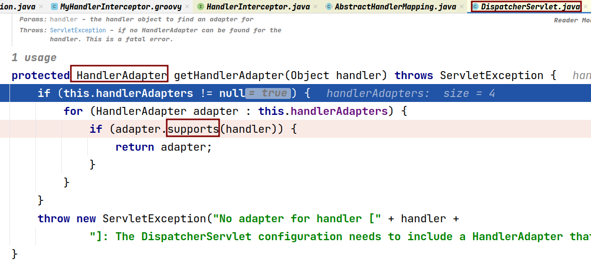
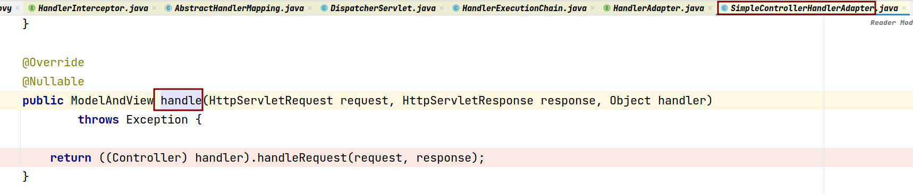
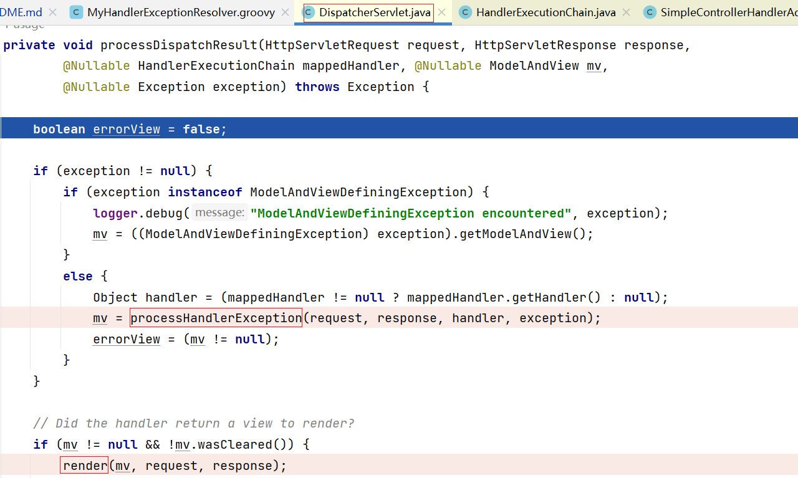
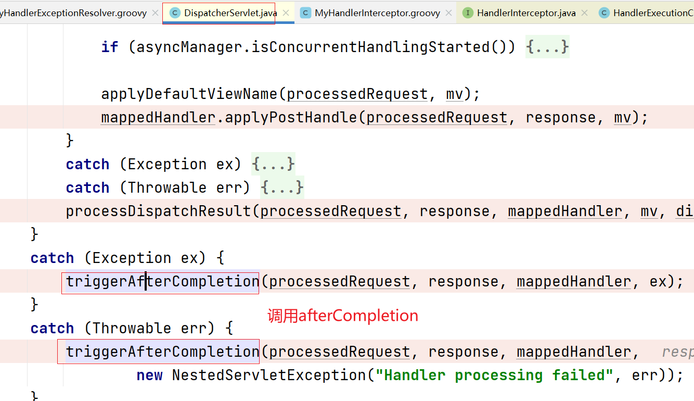

# spring-mvc

### Spring MVC 的简易流程

1. 首先配置在web.xml里的 `org.springframework.web.context.ContextLoaderListener` 会在其 `contextInitialized` 方法里初始化spring web 应用的上下文 `org.springframework.web.context.WebApplicationContext`

2. 然后在 `org.springframework.web.servlet.DispatcherServlet` 的父类 `org.springframework.web.servlet.HttpServletBean` 的 `init` 方法里进行初始化Servlet

3. 初始化Servlet后期在刷新完context后会去调用 `org.springframework.web.servlet.DispatcherServlet` 的 `onRefresh` 方法，该方法会初始化 `org.springframework.web.servlet.HandlerMapping` 和 `org.springframework.web.servlet.HandlerAdapter` 等之类的属性并设置到Servlet中

4. 需要注意的是在初始化Servlet过程中，也创建了一个spring web 应用的上下文 `org.springframework.web.context.WebApplicationContext` ，它对应加载mvc配置文件 `servletContext.xml` 里的bean，它的parent即为初始化监听器时初始化的context，而这个context对应加载的应用上下文配置文件 `applicationContext.xml`

5. 接下来是处理请求的过程
6. 对于 `DispatcherServlet` 来说，不管是GET请求还是POST请求都是调用其父类 `org.springframework.web.servlet.FrameworkServlet` 的 `processRequest` 方法，该方法最后还是把处理请求的主要逻辑交回了 `DispatcherServlet` 的 `doDispatch` 方法

7. 在 `doDispatch` 方法中，首先是根据请求去 `HandlerMapping` 中找handler，但是这个handler是一个 `org.springframework.web.servlet.HandlerExecutionChain` ，里面除了有我们写的Controller还有一些 `org.springframework.web.servlet.HandlerInterceptor` 用于对请求前后做一些处理， `HandlerInterceptor` 的调用是一个链式的过程，就像aop的 `MethodInvocation` 一样

8. 接着会根据handler去匹配 `org.springframework.web.servlet.HandlerAdapter` ，这里使用了适配器模式

9. 然后， `DispatcherServlet` 会去调用handler，并且是通过前面获得的适配器去调用的

10. 最后就是处理并调用配置的 `org.springframework.web.servlet.ViewResolver` 渲染请求的结果，如果在 `doDispatch` 方法之前的步骤中有异常产生，这里也会进行处理，我们自定义的 `org.springframework.web.servlet.HandlerExceptionResolver` 就是在这里被调用的

11. 我们在 `org.springframework.web.servlet.DispatcherServlet.initStrategies` 方法中初始化的属性大部分都是在 `doDispatch` 方法中被调用，我们自定义的 `HandlerInterceptor` —— 在 `HandlerExecutionChain` 中的 `HandlerInterceptor` 被调用也是在这时候

