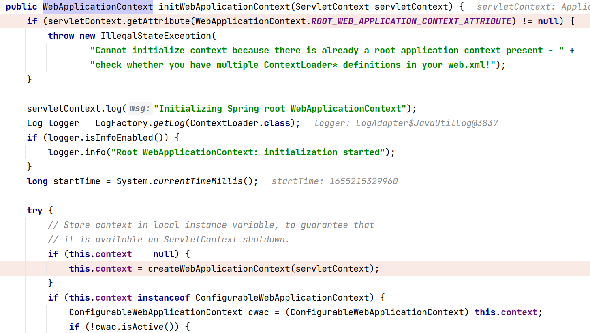

# spring-mvc

### Spring MVC 的简易流程

1. 首先配置在web.xml里的 `org.springframework.web.context.ContextLoaderListener` 会在其 `contextInitialized` 方法里初始化spring web 应用的上下文 `org.springframework.web.context.WebApplicationContext`

2. 