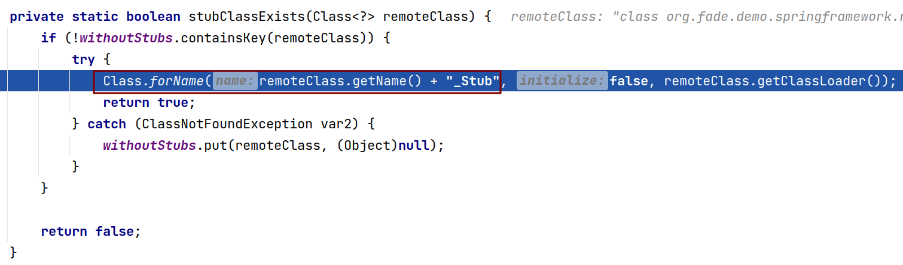

# rmi

### jdk rmi

###### 参考资料

[RMI 系列（02）源码分析](https://www.cnblogs.com/binarylei/p/12115986.html)

[源码层面梳理Java RMI交互流程](https://tttang.com/archive/1530/#toc_0x00-rmi)

###### 简单例子

远程对象以接口和实现类的形式存在

并且接口要继承 `java.rmi.Remote` 接口，实现类要继承 `java.rmi.server.UnicastRemoteObject` (不一定)

```groovy
package org.fade.demo.springframework.rmi

import java.rmi.Remote
import java.rmi.RemoteException

/**
 * <p>必须实现 {@link Remote} 接口
 * */
interface JdkRmiService extends Remote {

	/**
	 * <p>必须抛出 {@link RemoteException}
	 * */
	int add(int a, int b) throws RemoteException

}
```

```groovy
package org.fade.demo.springframework.rmi

import java.rmi.RemoteException
import java.rmi.server.UnicastRemoteObject

class JdkRmiServiceImpl extends UnicastRemoteObject implements JdkRmiService {

	@Override
	int add(int a, int b) throws RemoteException {
		a + b
	}

}
```

服务端

```groovy
package org.fade.demo.springframework.rmi

import java.rmi.registry.LocateRegistry

class JdkRmiServer {

	static void main(String[] args) {
		def service = new JdkRmiServiceImpl()
		def registry = LocateRegistry.createRegistry(9999)
		registry.bind("add", service)
	}

}
```

客户端

```groovy
package org.fade.demo.springframework.rmi

import java.rmi.Naming

class JdkRmiClient {

	static void main(String[] args) {
		def service = Naming.lookup("rmi://127.0.0.1:9999/add")
		println service.add(1, 2)
	}

}
```

###### 源码分析

1. 创建服务(远程)对象

因为服务对象继承了 `UnicastRemoteObject` 类，所以它在实例化的时候会去调用 `UnicastRemoteObject` 的构造方法：


`UnicastRemoteObject` 的构造方法一路执行到上面所示的图时，有几个关键的地方需要说明一下：

标号1主要是创建存根（stub）

标号2当存根是 `RemoteStub` 类型实例时，创建骨架（skeleton）

标号3启动其它线程进行网络通信并注册到 `ObjectTable` 中

标号4 `todo`

我们先来看看标号1：


这个if是判断是否存在是否存在以当前类名为前缀， `_Stub` 为后缀的类：




因为此时我们自定义的服务对象是不存在的，所以它最后执行的逻辑是：


这里的逻辑应该就挺熟悉的了，创建jdk动态代理， `InvocationHandler` 是 `RemoteObjectInvocationHandler` 类型的

因为前面标号1中我们创建的stub不是 `RemoteStub` 类型的，所以标号2这里我们不叙述

来看一下标号3：


`this.listen()` 启动其它线程进行网络通信：


注意这里启动了一个线程，它的 `Runnable` 是 `AcceptLoop` ，所以我们看一下 `AcceptLoop` 的run方法：


可以看到上图有一个 `this.serverSocket.accept()` ，这说明当前线程阻塞在这里等待socket的连接

回到前面， `super.exportObject(target)` 向 `ObjectTable` 注册自己（其实就是往几个map中存放一下）：


标号4 `todo`

2. 创建注册中心（Registry）


3. 

### spring rmi 简易流程

### 替代方案

