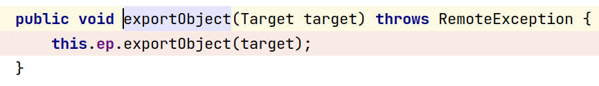
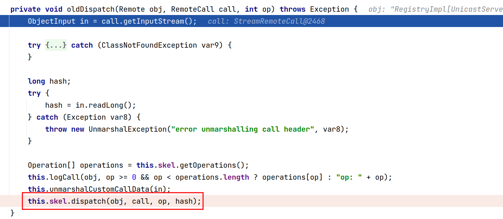

# rmi

### jdk rmi

###### 参考资料

[RMI 系列（02）源码分析](https://www.cnblogs.com/binarylei/p/12115986.html)

[源码层面梳理Java RMI交互流程](https://tttang.com/archive/1530/#toc_0x00-rmi)

###### 简单例子

远程对象以接口和实现类的形式存在

并且接口要继承 `java.rmi.Remote` 接口，实现类要继承 `java.rmi.server.UnicastRemoteObject` (不一定)

```groovy
package org.fade.demo.springframework.rmi

import java.rmi.Remote
import java.rmi.RemoteException

/**
 * <p>必须实现 {@link Remote} 接口
 * */
interface JdkRmiService extends Remote {

	/**
	 * <p>必须抛出 {@link RemoteException}
	 * */
	int add(int a, int b) throws RemoteException

}
```

```groovy
package org.fade.demo.springframework.rmi

import java.rmi.RemoteException
import java.rmi.server.UnicastRemoteObject

class JdkRmiServiceImpl extends UnicastRemoteObject implements JdkRmiService {

	@Override
	int add(int a, int b) throws RemoteException {
		a + b
	}

}
```

服务端

```groovy
package org.fade.demo.springframework.rmi

import java.rmi.registry.LocateRegistry

class JdkRmiServer {

	static void main(String[] args) {
		def service = new JdkRmiServiceImpl()
		def registry = LocateRegistry.createRegistry(9999)
		registry.bind("add", service)
	}

}
```

客户端

```groovy
package org.fade.demo.springframework.rmi

import java.rmi.Naming

class JdkRmiClient {

	static void main(String[] args) {
		def service = Naming.lookup("rmi://127.0.0.1:9999/add")
		println service.add(1, 2)
	}

}
```

###### 源码分析

1. 创建服务(远程)对象

因为服务对象继承了 `UnicastRemoteObject` 类，所以它在实例化的时候会去调用 `UnicastRemoteObject` 的构造方法：


`UnicastRemoteObject` 的构造方法一路执行到上面所示的图时，有几个关键的地方需要说明一下：

标号1主要是创建存根（stub）

标号2当存根是 `RemoteStub` 类型实例时，创建骨架（skeleton）

标号3启动其它线程进行网络通信并注册到 `ObjectTable` 中

标号4 `todo`

我们先来看看标号1：


这个if是判断是否存在是否存在以当前类名为前缀， `_Stub` 为后缀的类：


因为此时我们自定义的服务对象是不存在的，所以它最后执行的逻辑是：


这里的逻辑应该就挺熟悉的了，创建jdk动态代理， `InvocationHandler` 是 `RemoteObjectInvocationHandler` 类型的

因为前面标号1中我们创建的stub不是 `RemoteStub` 类型的，所以标号2这里我们不叙述

来看一下标号3：




`this.listen()` 启动其它线程进行网络通信：


注意这里启动了一个线程，它的 `Runnable` 是 `AcceptLoop` ，所以我们看一下 `AcceptLoop` 的run方法：


可以看到上图有一个 `this.serverSocket.accept()` ，这说明当前线程阻塞在这里等待socket的连接

回到前面， `super.exportObject(target)` 向 `ObjectTable` 注册自己（其实就是往几个map中存放一下）：


标号4 `todo`

2. 创建注册中心（Registry）


上面最后一张图（复用，并未实时截图）是不是很熟悉，没错也是 `sun.rmi.server.UnicastServerRef.exportObject(java.rmi.Remote, java.lang.Object, boolean)` 方法

区别不同的是标号1我们最后执行的逻辑是：


就是用反射创建了以当前类名为前缀， `_Stub` 为后缀的类的实例

回到前面，这里因为当前创建的stub是 `RemoteStub` 类型的：


所以它会去执行标号2的逻辑：


同样也是反射创建了以 `_Skel` 为后缀的类的实例

其余步骤就和创建服务对象没什么很大的区别了

3. 绑定服务

绑定服务只是往注册中心的 `Hashtable` 注册一下：


4. 客户端获取注册中心


注册中心的获取我们看下标注1：


没错，又跑到了上面最后一张图（复用，并未实时截图）。因为它存在以 `_Stub` 为后缀的类，所以该方法的返回值是 `RegistryImpl_Stub` 类型的实例

5. 客户端获取远程对象


获取远程对象看一下标号2：


`this.ref.newCall` 与注册中心建立连接，此时服务端（todo）阻塞的线程获取到了客户端的socket，会去提交一个处理连接的任务给线程池：


于是我们来看一下 `ConnectionHandler` 的run方法：


`ObjectTable.getTarget(new ObjectEndpoint(id, transport))` 是从 `ObjectTable` 中取出前面创建注册中心时注册的对象

`disp.dispatch(impl, call)` 会进入到前面创建注册中心时创建的骨架（skeleton）的dispatch方法中 ：





上图 `SharedSecrets.getJavaObjectInputStreamReadString().readString(in)` 在方法名尚未被客户端传输过来之前会阻塞在那里

回到前面客户端的步骤， `out.writeObject($param_String_1)` 把需要调用的方法写到输出流上

`this.ref.invoke(call)` 与注册中心交互，把要调用的方法名发送过去。然后服务端读取到方法名：


上图 `server.lookup($param_String_1)` 从注册中心的 `Hashtable` 里取出服务对象：


而 `out.writeObject($result)` 则是把服务对象写入输出流，但是在写的过程中，这里动了些手脚：


这里实际上是把我们创建服务对象时生成动态代理对象返回给了客户端

回到前面客户端的步骤，`$result = (Remote)in.readObject()` 反序列化远程对象

6. 客户端调用远程方法

因为客户端获取到的远程对象实际是服务端创建服务对象时产生的动态代理对象，所以我们看下 `RemoteObjectInvocationHandler` 的 `invoke` 方法：


上图首先序列化调用的参数写入输出流，此时服务端负责网络通信的线程监听到请求，会依次执行到这里：


先是取出要执行的 `Method` 对象，然后反序列化参数


反射调用相应的方法，序列化返回值

回到客户端 `sun.rmi.server.UnicastRef.invoke(java.rmi.Remote, java.lang.reflect.Method, java.lang.Object[], long)` 方法，客户端最后会在这反序列化远程方法返回值：


###### 总结


### spring rmi 简易流程

### 替代方案

