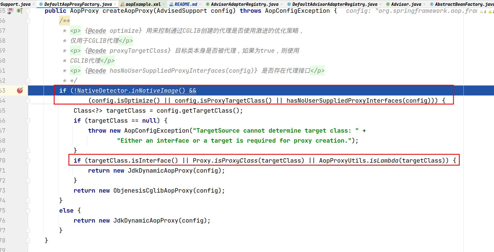
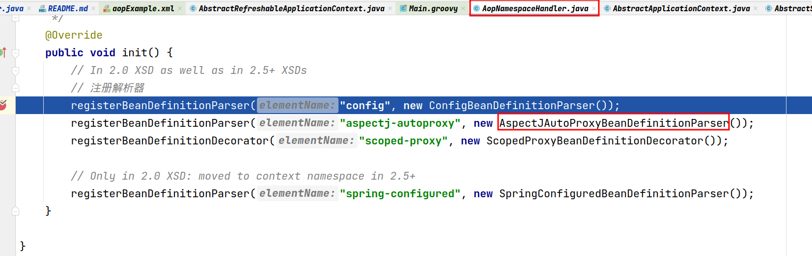
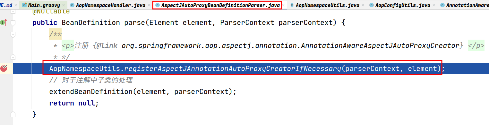
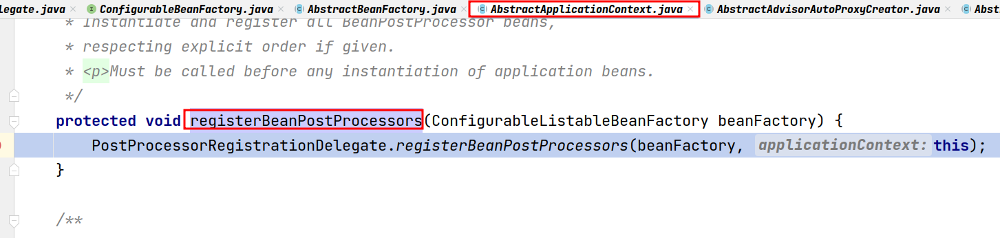
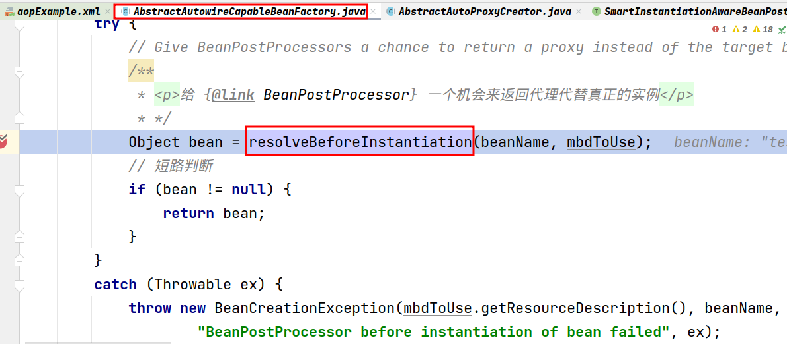
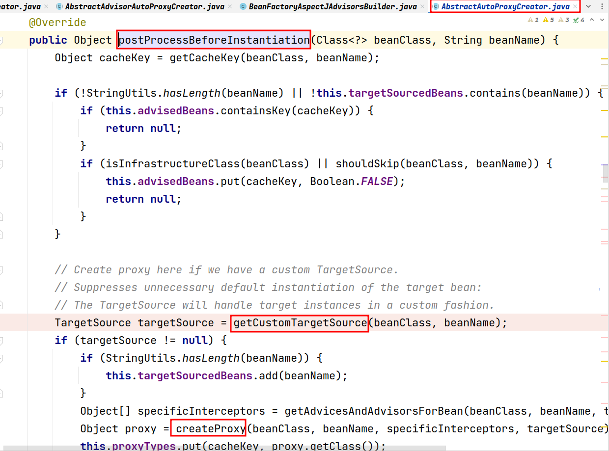
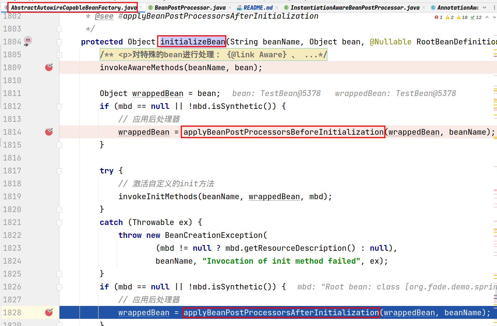
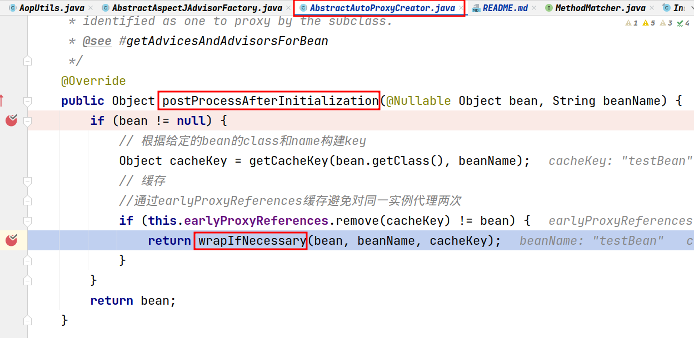
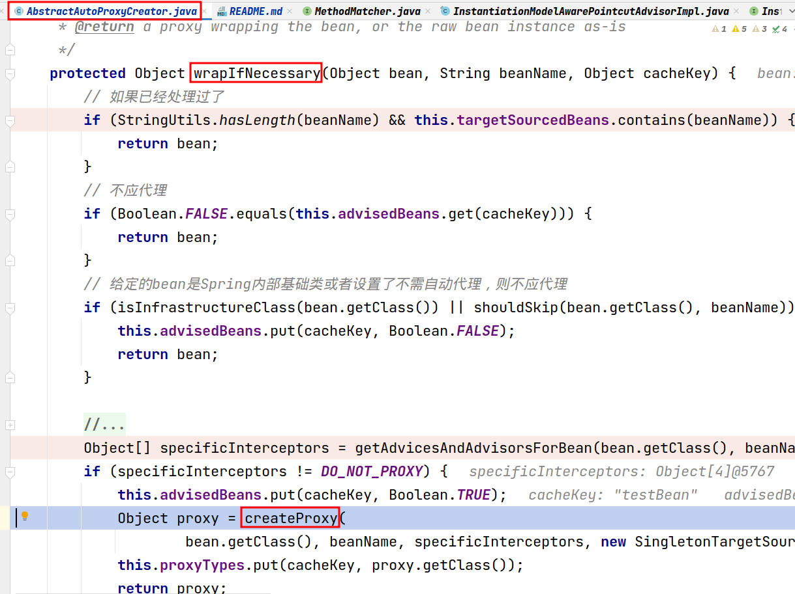

# spring-aop

### CGLIB代理和JDK代理的使用场景

xml方式下比较关键的一个配置是 `<aop:aspectj-autoproxy />` 标签的 `proxy-target-class` 属性

### 几种通知类型的执行顺序

todo

### AOP的整个流程

XML方式（以测试资源目录下的 `aopExample.xml` 中的 `testBean` 的获取为例 ）：

1. 解析XML文件时，在 `AopNamespaceHandler#init` 中注册 `<aop:aspectj-autoproxy />` 标签对应的解析器 `AspectJAutoProxyBeanDefinitionParser`

2. 调用 `AspectJAutoProxyBeanDefinitionParser#parse` 方法注册 `AnnotationAwareAspectJAutoProxyCreator` 

3. 因为 `AnnotationAwareAspectJAutoProxyCreator` 实现了 `BeanPostProcessor` 接口，所以会在 `AbstractApplicationContext#registerBeanPostProcessors` 中把它注册到 `AbstractBeanFactory` 的 `beanPostProcessors` 属性中

4. 又因为 `AnnotationAwareAspectJAutoProxyCreator` 实现的是 `BeanPostProcessor` 的子接口 `InstantiationAwareBeanPostProcessor` ，所以在获取bean时，它的 `applyBeanPostProcessorsBeforeInstantiation` 方法和 `applyBeanPostProcessorsAfterInitialization` 方法会被 `AbstractAutowireCapableBeanFactory#resolveBeforeInstantiation` 调用。在 `applyBeanPostProcessorsBeforeInstantiation` 方法里，Spring主要对当前bean作了以下操作：
    1. 判断当前bean是否需要代理
    2. 如果存在自定义的 `TargetSource` ，则立即创建代理；否则只是缓存 `Advisor`

5. 接着在当前bean被实例化后，Spring会在 `AbstractAutowireCapableBeanFactory#initializeBean` 方法对当前bean应用 `AnnotationAwareAspectJAutoProxyCreator` 的 `postProcessBeforeInitialization` 和 `postProcessAfterInitialization` 方法，而就是在 `postProcessAfterInitialization` 方法中，Spring会为当前bean创建代理

### AOP概念与Spring中实现的对应关系

* 切面 —— `@Aspect` 注解， `Advisor` 接口及其实现类
* 通知 —— `Advice` 接口及其实现类， `@Before` 、 `@After` 、 `@Around` 、 `@AfterThrowing` 、 `@AfterReturing` 注解
* 切点 —— `@Point` 、 `@Before` 、 `@After` 、 `@Around` 、 `@AfterThrowing` 、 `@AfterReturing` 注解的 `value` 属性及 `AspectJExpressionPointcut` 类

### AOP中 `Advisor` 、 `Advice` 、 `Interceptor` 、 `MethodInterceptor` 等几个名词之间的关系

todo