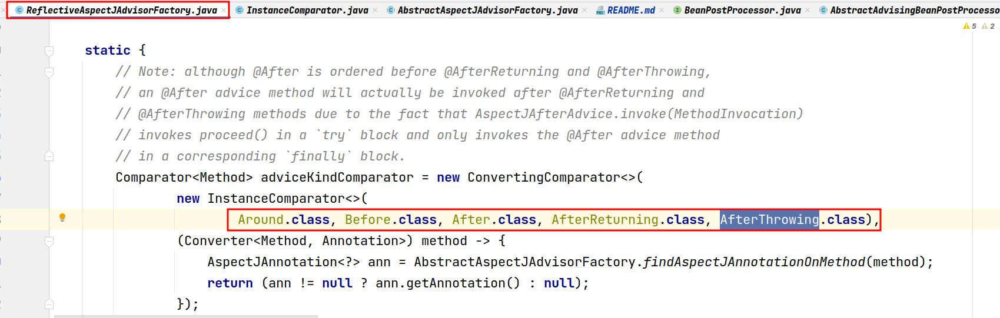

# spring-aop

### CGLIB代理和JDK代理的使用场景


xml方式下比较关键的一个配置是 `<aop:aspectj-autoproxy />` 标签的 `proxy-target-class` 属性

### 几种通知类型的执行顺序

在 `ReflectiveAspectJAdvisorFactory` 类中定义了 `adviceMethodComparator` ，该比较器会根据 `Around` -> `Before` -> `After` -> `AfterReturning` -> `AfterThrowing` 的顺序对通知进行排序



对于分布在不同切面的通知，还要考虑是否实现了 `Ordered` 接口或使用了 `@Order` 注解，这点有在 `org.springframework.aop.aspectj.autoproxy.AspectJAwareAdvisorAutoProxyCreator#sortAdvisors` 方法中体现：


当然，通知的执行顺序还和通知方法的调用顺序有关，例如：


### AOP的整个流程

XML方式（以测试资源目录下的 `aopExample.xml` 中的 `testBean` 的获取为例 ）：

1. 解析XML文件时，在 `AopNamespaceHandler#init` 中注册 `<aop:aspectj-autoproxy />` 标签对应的解析器 `AspectJAutoProxyBeanDefinitionParser`


2. 调用 `AspectJAutoProxyBeanDefinitionParser#parse` 方法注册 `AnnotationAwareAspectJAutoProxyCreator` 


3. 因为 `AnnotationAwareAspectJAutoProxyCreator` 实现了 `BeanPostProcessor` 接口，所以会在 `AbstractApplicationContext#registerBeanPostProcessors` 中把它注册到 `AbstractBeanFactory` 的 `beanPostProcessors` 属性中


4. 又因为 `AnnotationAwareAspectJAutoProxyCreator` 实现的是 `BeanPostProcessor` 的子接口 `InstantiationAwareBeanPostProcessor` ，所以在获取bean时，它的 `applyBeanPostProcessorsBeforeInstantiation` 方法和 `applyBeanPostProcessorsAfterInitialization` 方法会被 `AbstractAutowireCapableBeanFactory#resolveBeforeInstantiation` 调用。在 `applyBeanPostProcessorsBeforeInstantiation` 方法里，Spring主要对当前bean作了以下操作：
    1. 判断当前bean是否需要代理
    2. 如果存在自定义的 `TargetSource` ，则立即创建代理；否则只是缓存 `Advisor`


5. 接着在当前bean被实例化后，Spring会在 `AbstractAutowireCapableBeanFactory#initializeBean` 方法对当前bean应用 `AnnotationAwareAspectJAutoProxyCreator` 的 `postProcessBeforeInitialization` 和 `postProcessAfterInitialization` 方法，而就是在 `postProcessAfterInitialization` 方法中，Spring会为当前bean创建代理


6. cglib 方式下：
   1. 在创建代理时有创建 `Callback` 放至 `Enhancer` 对象里这么一步，在这一步中创建了 `DynamicAdvisedInterceptor` ，该 `Callback` 会处理我们平时遇到的大部分动态代理情景：

   
   2. 在 `DynamicAdvisedInterceptor` 的 `intercept` 方法里会执行我们定义的代理逻辑， `intercept` 方法还创建了一个 `CglibMethodInvocation` 用于拦截器链的调用：

   
   3. `CglibMethodInvocation` 的 `proceed` 方法会调用其父类 `ReflectiveMethodInvocation` 的 `proceed` 方法用于链式调用拦截器：
   
   
   4. 接下来就是各个 `Adivce` 适配而成的 `MethodInterceptor` 的调用过程......
7. jdk 方式下：
   1. 在创建代理时有调用 `Proxy.newProxyInstance` 方法并传递一个 `InvocationHandler` 进去的步骤，Spring这里把 `JdkDynamicAopProxy` 对象自身传递了进去：
  
   
   2. `JdkDynamicAopProxy` 的 `invoke` 方法起到的作用和 `DynamicAdvisedInterceptor` 的 `intercept` 方法是类似的，它创建了 `ReflectiveMethodInvocation` 用于拦截器链的调用：

   
   3. 接下来也同样是各个 `Adivce` 适配而成的 `MethodInterceptor` 的调用过程......

### AOP概念与Spring中实现的对应关系

* 切面 —— `@Aspect` 注解， `Advisor` 接口及其实现类
* 通知 —— `Advice` 接口及其实现类， `@Before` 、 `@After` 、 `@Around` 、 `@AfterThrowing` 、 `@AfterReturing` 注解
* 切点 —— `@Point` 、 `@Before` 、 `@After` 、 `@Around` 、 `@AfterThrowing` 、 `@AfterReturing` 注解的 `value` 属性及 `AspectJExpressionPointcut` 类

### AOP中 `Advisor` 、 `Advice` 、 `Interceptor` 、 `MethodInterceptor` 等几个名词之间的关系

`Adivce` 、 `Interceptor` 和 `MethodInterceptor` 是 `aopalliance` 中的概念，而 `Advisor` 是 `spring-aop` 中的概念。 `Advice` 是通知， `Interceptor` 和 `MethodInterceptor` 是 `Advice` 的子类，但在AOP的实现中，通知最后是以 `MethodInterceptor` 的形式被调用，即使是不是 `MethodInterceptor` 子类的对象也会被适配为 `MethodInterceptor` ：


至于 `Advisor` ， `Advisor` 是通知器，其子接口的实现类 `PointcutAdvisor` 中既包含有切点信息，又包含有 `Advice` 的实现类

### 不用 `@AspectJ` 注解实现AOP

查看下面的测试案例：

```java
@Test
void aopWithNoAspectAnnotation() {
    def context = new ClassPathXmlApplicationContext("org/fade/demo/springframework/aop/aopWithNoAspectAnnotation.xml")
    def demoService = context.getBean("demoService", DemoService)    
    demoService.test()        
}
```