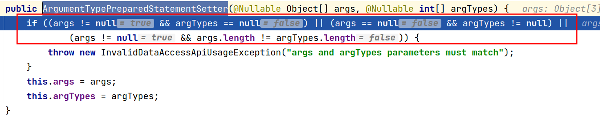
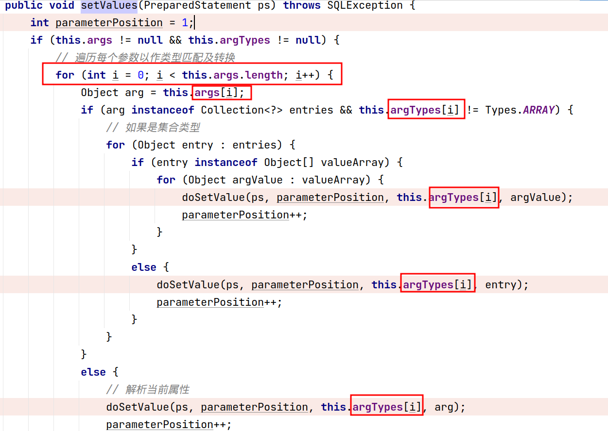
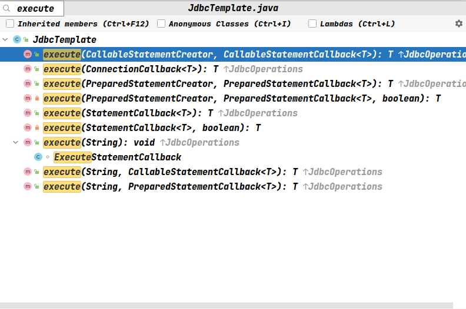
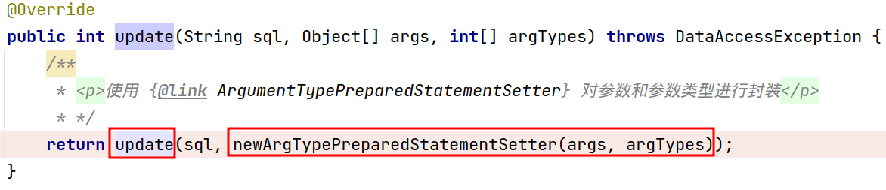
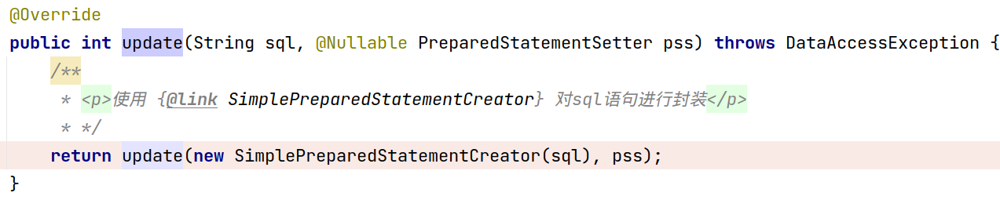
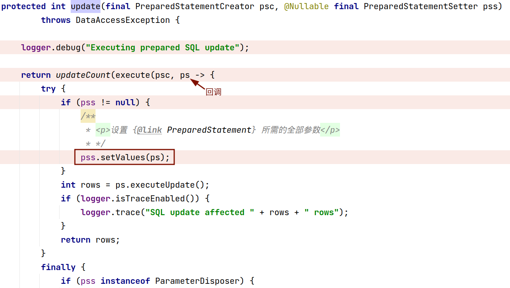
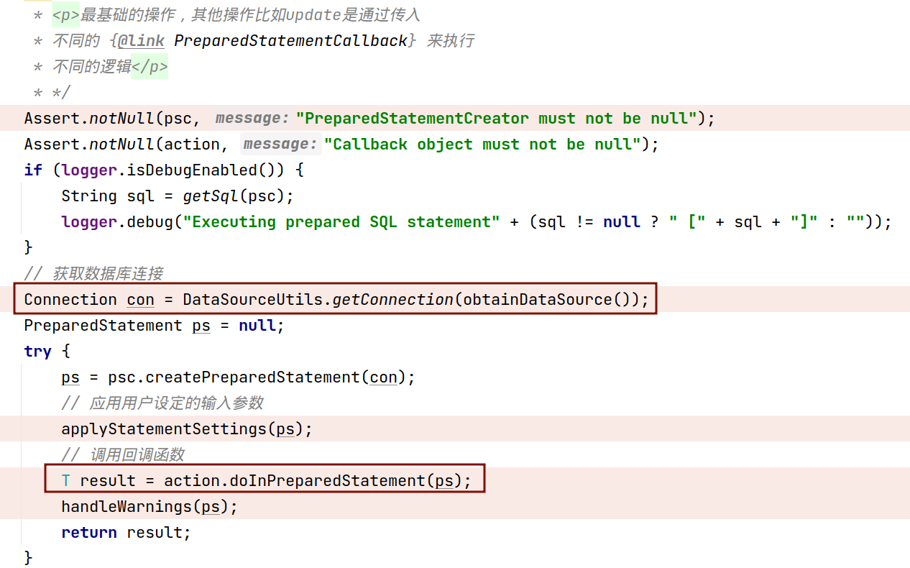
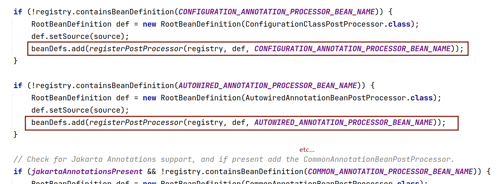

# spring-jdbc

### `org.springframework.jdbc.core.ArgumentTypePreparedStatementSetter.setValues` 中的遍历方式当遇到传递的参数和需要的参数不一致时怎么处理？

1. 首先在创建 `ArgumentTypePreparedStatementSetter` 时，它会校验参数和参数类型两个数组的长度是否一样，如果不一样则抛出异常



2. 上面确保了两个数组的长度相等后，在 `org.springframework.jdbc.core.ArgumentTypePreparedStatementSetter.setValues` 方法中以 `args.length` （参数数组长度）控制循环是不会在访问参数数组和参数类型数组时出现数组越界现象的



3. 但是spring-jdbc无法保证在给 `PreparedStatement` 设置参数时是否会出现数组越界，例如下面这段测试代码：

```
@Override
void saveThrowException(User user) {
    jdbcTemplate.update("insert into user(name, age, sex) values(?, ?, ?)", 
	new Object[] {List.of(user.getName(), "test"), user.getAge(), user.getSex()}, 
	new int[] {Types.VARCHAR, Types.INTEGER, Types.VARCHAR})
}
```

除非你的参数占位符数量多于参数数组长度（=参数类型数组长度），但是这样用要小心参数类型数组内容的设置，例如：

```
@Override
void saveWithoutArrayIndexOutOfBound(User user) {
    jdbcTemplate.update("insert into user(name, sex, age) values(?, ?, ?)", 
	new Object[] {List.of(user.getName(), user.getSex()), user.getAge()}, 
	new int[] {Types.VARCHAR, Types.INTEGER})
}
```

### jdbc简易流程

spring-jdbc 是对jdbc操作的封装，封装的结果是 `JdbcTemplate` 。

`JdbcTemplate` 中比较重要的方法是 `execute` 方法，通过 `JdbcTemplate` 实现对数据库的增删改差最后都要归结于 `execute` 的几个重载的方法：



由上图可见，针对不同的 `Statement` ， `JdbcTemplate` 有不同的实现。

以 `org.springframework.jdbc.core.JdbcTemplate.update(java.lang.String, java.lang.Object[], int[])` 为例，我们来看一下spring-jdbc的简易流程：

1. 在 `org.springframework.jdbc.core.JdbcTemplate.update(java.lang.String, java.lang.Object[], int[])` 中，它把参数和参数类型用 `ArgumentTypePreparedStatementSetter` 进行封装，并将其作为一个参数传递给 `org.springframework.jdbc.core.JdbcTemplate.update(java.lang.String, org.springframework.jdbc.core.PreparedStatementSetter)` 



2. 在 `org.springframework.jdbc.core.JdbcTemplate.update(java.lang.String, org.springframework.jdbc.core.PreparedStatementSetter)` 中，该方法用 `SimplePreparedStatementCreator` 对sql进行封装，并将其和上一步产生的 `ArgumentTypePreparedStatementSetter` 作为参数传递给 `org.springframework.jdbc.core.JdbcTemplate.update(org.springframework.jdbc.core.PreparedStatementCreator, org.springframework.jdbc.core.PreparedStatementSetter)` 



3. 在 `org.springframework.jdbc.core.JdbcTemplate.update(org.springframework.jdbc.core.PreparedStatementCreator, org.springframework.jdbc.core.PreparedStatementSetter)` 方法中，spring-jdbc主要是调用了 `execute` 方法，并传递了一个 `PreparedStatementCallback` 回调函数给 `execute` 方法，回调函数中主要是给 `PreparedStatement` 中的参数进行赋值



4. 而该 `execute` 方法最主要的操作就是获取数据库连接并调用前面传入的回调函数



`JdbcTemplate` 实现对数据库的增删改差的其余流程大体都和上面的类似

### `FactoryBean` 的用法和调用时机

`FactoryBean` 字面意思为工厂bean，spring的工厂bean使用了工厂模式和单例模式。如果想要获取的bean的name不包含 `&` ，那么每次通过 `getBean` 方法获取的bean实则是调用实现 `FactoryBean` 接口的类的 `getObject()` 方法的结果。

大致的调用流程为：

1. `org.springframework.beans.factory.support.AbstractBeanFactory.doGetBean`
2. `org.springframework.beans.factory.support.AbstractAutowireCapableBeanFactory.getObjectForBeanInstance`
3. `org.springframework.beans.factory.support.AbstractBeanFactory.getObjectForBeanInstance`
4. `org.springframework.beans.factory.support.FactoryBeanRegistrySupport.getObjectFromFactoryBean`
5. `org.springframework.beans.factory.support.FactoryBeanRegistrySupport.doGetObjectFromFactoryBean`

### `InitializingBean` 的用法和调用时机

spring支持两种初始化bean的方式，一种是指定 `init-method` ，一种则是实现 `InitializingBean` 接口。

实现 `InitializingBean` 接口的bean在创建时填充完依赖的属性后，会去调用其 `afterPropertiesSet` 方法。且在调用完 `afterPropertiesSet` 方法后，若存在 `init-method` ，则会继续调用 `init-method` 。

大致的调用流程为：

1. `org.springframework.beans.factory.support.AbstractAutowireCapableBeanFactory.doCreateBean`
2. `org.springframework.beans.factory.support.AbstractAutowireCapableBeanFactory.initializeBean(java.lang.String, java.lang.Object, org.springframework.beans.factory.support.RootBeanDefinition)`
3. `org.springframework.beans.factory.support.AbstractAutowireCapableBeanFactory.invokeInitMethods`

### spring对于自动扫描的注册流程

Mybatis的 `ClassPathMapperScanner` 只是扫描注册的一个示例，更为通用的一个示例是 `ComponentScan` 注解。

我们从下面这个测试用例入手：

```
@Test
void scannedExample() {
    def context = new AnnotationConfigApplicationContext(Config)
    def bean = context.getBean("scannedBean", ScannedBean)
    bean.doSomething()
}
```

1. 首先在创建 `ApplicationContext` 的时候会注册传进来的配置类和一些bean工厂的后置处理器
   1. 注册bean工厂后置处理器的路径为： `org.springframework.context.annotation.AnnotationConfigApplicationContext.AnnotationConfigApplicationContext(java.lang.Class<?>...)` -> `org.springframework.context.annotation.AnnotationConfigApplicationContext.AnnotationConfigApplicationContext()` -> `org.springframework.context.annotation.AnnotatedBeanDefinitionReader.AnnotatedBeanDefinitionReader(org.springframework.beans.factory.support.BeanDefinitionRegistry)` -> `org.springframework.context.annotation.AnnotatedBeanDefinitionReader.AnnotatedBeanDefinitionReader(org.springframework.beans.factory.support.BeanDefinitionRegistry, org.springframework.core.env.Environment)` -> `org.springframework.context.annotation.AnnotationConfigUtils.registerAnnotationConfigProcessors(org.springframework.beans.factory.support.BeanDefinitionRegistry)` 
   
   
   2. 注册传进来的配置类的路径为：