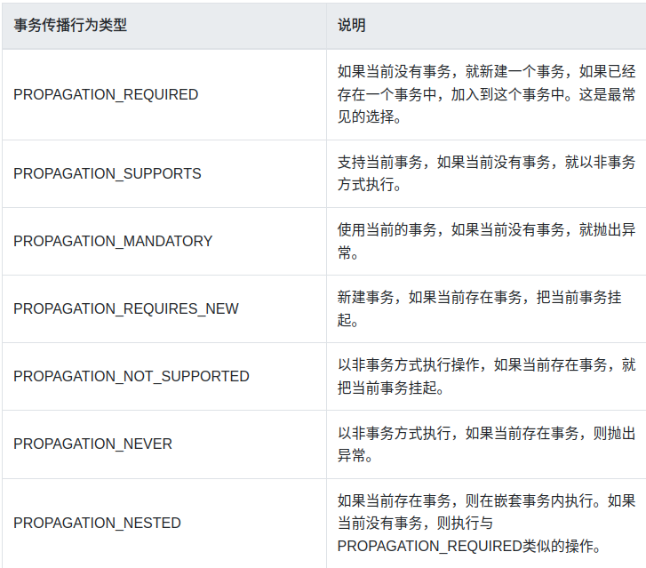

# spring-tx

### 核心的几个类

* `TxNamespaceHandler`
* `AbstractAutoProxyCreator`
* `TransactionInterceptor`

### 事务传播行为案例

##### 参考文章：

1. [Spring事务传播行为详解](https://segmentfault.com/a/1190000013341344)

spring中的事务传播行为：



这也可以通过查看 `org.springframework.transaction.annotation.Propagation` 得知

##### `Propagation.REQUIRED`

示例代码：

```groovy
@Service
class PropagationUserService1 {

	@Resource
	private PropagationUserRepository propagationUserRepository

	@Transactional(propagation = Propagation.REQUIRED)
	void addRequired(PropagationUser user) {
		propagationUserRepository.save(user)
	}

}
```

```groovy
@Service
class PropagationUserService2 {

	@Resource
	private PropagationUserRepository propagationUserRepository

	@Transactional(propagation = Propagation.REQUIRED)
	void addRequired(PropagationUser user){
		propagationUserRepository.save(user)
	}

	@Transactional(propagation = Propagation.REQUIRED)
	void addRequiredException(PropagationUser user){
		propagationUserRepository.save(user)
		throw new RuntimeException()
	}

}
```

